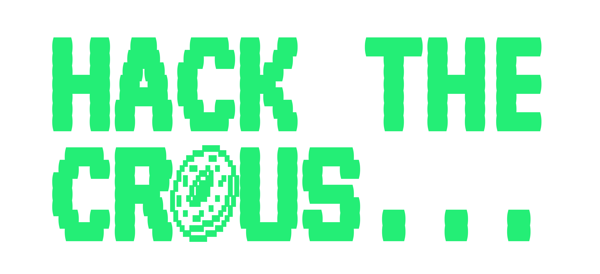

<a href="https://hackthecrous.com">Eat smart & hack the CR🍩US</a>

---

Hack the cr🍩us is an open-source project that aims to provide a useful website for students to find the best meals in their local university canteens.
For now, it provides a search engine, a list of meals and how close they are to each building of the university.

⚠️ This repository is not (yet) the live version of the project. This is a complete rewrite of the original project, which can be found [here](https://github.com/Courtcircuits/HackTheCrous.crawler). The live version is still available at [hackthecrous.com](https://hackthecrous.com), but it is not being updated anymore.

## Code base layout

The code base is organized into five main folders:

- **api** : the folder that contains the code for the API, which provides a headless HTTP interface to the data. It is built using axum.
- **scraper** : the folder that contains the code for the scraping logic, which is responsible for data collection and processing. It does indexation, data cleaning, HTML parsing. But also connects to open API's to feed the database with more data.
- **web** : the folder that contains the code for the web application.
- **core** : the folder that contains the shared code between the API and the scraper, such as the database models and some data processing logic.
- **cli** : this contains the code for `crousctl`, a command-line tool to administrate hack the crous but also to run the scraper from any machine.
